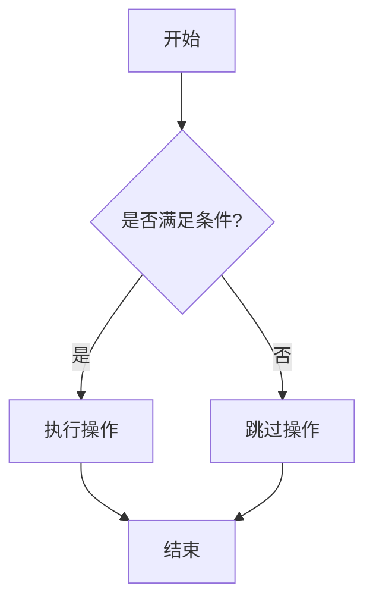

# Mermaid 流程图预览工具

## 项目简介

这是一个基于 Web 的 Mermaid 流程图预览工具，允许用户实时编辑和预览 Mermaid 语法的流程图、时序图、甘特图等各种图表。

## 功能特性

- 🎨 实时预览 Mermaid 图表
- 📝 内置代码编辑器，支持语法高亮
- 🖥️ 响应式设计，支持各种屏幕尺寸
- 🔍 缩放控制，支持放大、缩小、重置、适应屏幕等缩放操作
- 🖱️ 拖拽移动，支持鼠标拖拽移动图表位置
- 🎪 全屏预览，支持全屏模式查看流程图，获得更好的视觉体验
- 💾 导出功能，支持 SVG 和 PNG 格式导出
- 🎯 支持多种 Mermaid 图表类型：
  - 流程图 (Flowchart)
  - 时序图 (Sequence Diagram)
  - 甘特图 (Gantt Chart)
  - 类图 (Class Diagram)
  - 状态图 (State Diagram)
  - 用户旅程图 (User Journey)
  - Git 图 (Git Graph)
  - 饼图 (Pie Chart)

## 使用方法

1. 在浏览器中打开 `index.html` 文件
2. 在左侧编辑器中输入 Mermaid 语法代码
3. 右侧会实时显示生成的图表
4. 支持复制、导出等功能

## 示例代码



## 技术栈

- HTML5
- CSS3
- JavaScript (ES6+)
- Mermaid.js
- CodeMirror (代码编辑器)

## 项目结构

```
mermaid/
├── index.html                    # 主页面文件
├── README.md                     # 项目说明文档
└── complex-flowchart-examples.md # 复杂流程图样例文档
```

## 开发日志

### 功能实现记录

- [✅ 已完成] 创建基本 HTML 结构
  - 实现方案：使用响应式布局，左右分栏设计，左侧为代码编辑器，右侧为图表预览区域
- [✅ 已完成] 集成 Mermaid.js 库
  - 实现方案：通过 CDN 引入 Mermaid.js v10.6.1，配置安全级别和主题
- [✅ 已完成] 添加代码编辑器功能
  - 实现方案：集成 CodeMirror 编辑器，支持语法高亮、行号显示、自动补全等功能
- [✅ 已完成] 实现实时预览功能
  - 实现方案：监听编辑器内容变化，使用防抖机制（500ms）实时渲染 Mermaid 图表
- [✅ 已完成] 美化界面设计
  - 实现方案：采用现代化渐变背景、卡片式布局、响应式设计，支持移动端适配
- [✅ 已完成] 添加示例代码功能
  - 实现方案：内置 6 种常用图表类型示例（流程图、时序图、甘特图、类图、状态图、饼图）
- [✅ 已完成] 导出功能
  - 实现方案：支持导出 SVG 和 PNG 格式的图表文件
- [✅ 已完成] 创建复杂流程图样例文档
  - 实现方案：创建了包含电商订单处理、软件开发生命周期、用户权限管理等3个复杂业务流程图的样例文档
- [✅ 已完成] 优化预览区域缩放功能
  - 实现方案：添加放大、缩小、重置、适应屏幕四个缩放按钮，支持鼠标滚轮缩放，实现拖拽移动功能，缩放范围10%-300%
- [✅ 已完成] 添加全屏预览功能
  - 实现方案：添加全屏按钮，支持全屏模式下的独立缩放和拖拽控制，提供ESC键和点击背景退出全屏，全屏模式下缩放范围10%-500%

### Bug 修复记录

- [✅ 已修复] 导出 PNG 功能失效
  - 问题描述：点击“导出 PNG”按钮时，由于 SVG 缺少明确的宽高属性、canvas 渲染问题或浏览器跨域安全限制（Tainted Canvas），导致无法生成图片。
  - 修复方案：
    1. 引入 `canvg` 库作为备用渲染引擎，解决本地文件（file://）或跨域环境下原生 Canvas 导出失败的问题。
    2. 实现了双重保障机制：优先尝试原生浏览器渲染（清晰度更高），如果失败（如捕获到 SecurityError 或图片加载错误）自动切换到 Canvg 渲染。
    3. 克隆 SVG 节点并进行标准化处理（添加 xmlns、viewBox、固定宽高），确保渲染一致性。
    4. 使用 2 倍缩放进行渲染，提高导出图片的清晰度。
    5. 为导出的图片添加白色背景和适当的内边距。
  - 注意事项：在本地直接打开 HTML 文件（file:// 协议）时，原生导出可能会因为浏览器安全策略而失败，此时会自动降级使用 Canvg，但建议尽量在 Web 服务器环境下运行以获得最佳体验。

- [✅ 已优化] 提升 Mermaid 兼容性和错误提示
  - 优化内容：
    1. 将 Mermaid 库升级至 v11.12.2（最新版），提升对新语法和特殊字符的支持。
    2. 增强错误处理机制，增加智能错误分析功能。
    3. 提供更友好的中文错误提示，针对常见问题（如中文标点、特殊字符）给出具体修复建议。
    4. 优化渲染逻辑，避免在编辑过程中频繁清除画布导致闪烁。

## 许可证

MIT License